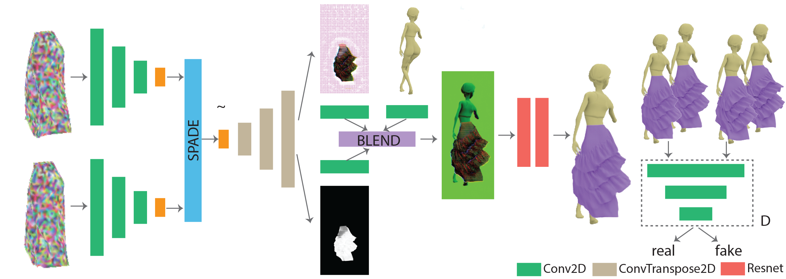

# DynamicNeuralGarments

## Introduction

This repository contains the implemetation of [Dynamic Nerual Garments](http://geometry.cs.ucl.ac.uk/projects/2021/DynamicNeuralGarments/) proposed in Siggraph Asia 2021.

## ./GarmentMotionRenderer
This folder contains the pytorch implementation of the rendering network.
  
You can play with the code by running "run.py" after downloading data and checkpoint from [here](https://drive.google.com/drive/folders/1F-ZGdAiAR1ORiGtYoW87Pq4gMJa70Sfz?usp=sharing). You will get the similar results as shown below by respectively running the check point from [multilayers](https://drive.google.com/drive/folders/1DrQJoUI7gb2N3qOxfM8cOW3iLThZ0vAD?usp=sharing), [tango](https://drive.google.com/drive/folders/1jJaFBwQGstLJBMaj2J93Sw9Y5GsLcvGT?usp=sharing), [twolayers](https://drive.google.com/drive/folders/1jJaFBwQGstLJBMaj2J93Sw9Y5GsLcvGT?usp=sharing)  
  

In case you want to retrain the network, you can download the training data from [here](https://drive.google.com/drive/folders/1uBp5TUSFTzYGJnIwWbfrNSVt0yp-uykv?usp=sharing). We provide the 3D meshes of [coarse garment](https://drive.google.com/file/d/1VEBjD3Aaj5mXI_n4l-8_k7Od03Br9s4P/view?usp=sharing), and the target garments including [multilayers](https://drive.google.com/file/d/1HQbSJumf8LYZekcK-ehhb7VbApjSqmhM/view?usp=sharing), [tango](https://drive.google.com/file/d/1np43-Fyf1WMcgYfrKKC1cl3o55hWhRmB/view?usp=sharing), and [twolayers](https://drive.google.com/file/d/1KWqy72B7nJf07qk6-aS_B5_77OSPgm_8/view?usp=sharing). You will first run the [blender project](https://drive.google.com/file/d/1P-_Dzeu84cpK94_GFzoqlvEbEAS2VRAY/view?usp=sharing) to generate the groundtruth rendering, background rendering and save the corresponding camera poses. Next, you need to compute the texture sampling map by referring to the codes in **./PixelSample**. After gathering all needed data, you can give a shot at "train.py".

## ./PixelSample
This folder contains the code to generate texture sampling map. The C++ codes rely on [OpenCV](https://opencv.org/releases/), and [Embree](https://github.com/embree/embree). 

## ./blenderScript
This folder contains python script for blender.

## Citation
If you use our code or model, please cite our paper:

  @article{zhang2021dynamic,
  title={Dynamic Neural Garments},
  author={Zhang, Meng and Ceylan, Duygu and Wang, Tuanfeng and Mitra, Niloy J},
  journal={arXiv preprint arXiv:2102.11811},
  year={2021}
}
